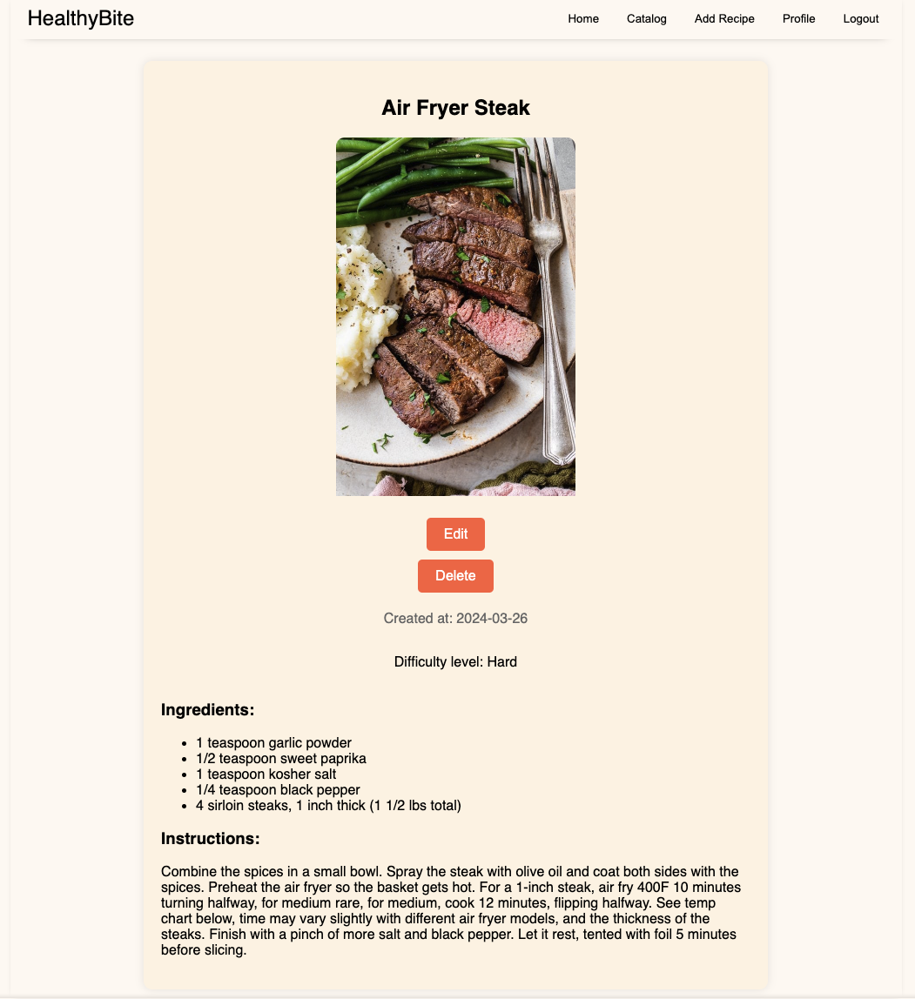

# HealthyBite 🌱🍴

Welcome to HealthyBite, where good food meets good health. Our Angular-based platform is a sanctuary for health enthusiasts to discover, share, and enjoy wholesome recipes. HealthyBite is a testament to the belief that healthy food can and should be delicious and accessible to all.

## Core Features

### Public Access:
- **Recipe Exploration**: Browse a curated selection of recipes that cater to various dietary needs.
- **Search**: Utilize advanced search options to find recipes that suit your taste and dietary preferences.

### Member Privileges:
- **Add Recipes**: Share your favorite healthy recipes with the community.
- **Edit Recipes**: Update and refine your recipes at any time.
- **Delete Recipes**: Remove recipes you've posted whenever you choose.
- **Save Favorites**: Keep a personal collection of recipes you love for quick access.
- **Profile Page**: Manage your culinary contributions and view your saved favorites.

## System Architecture
- **Client-Side**: Angular v16
- **Server-Side**: Express.js
- **Database**: MongoDB

## Setup Instructions
1. **Source Retrieval**: Clone the project repository to get started with your local setup.
2. **Dependencies**: Navigate to the project directory and execute `npm install` to install all dependencies.
3. **Server Initialization**:
   - Verify MongoDB is functioning on your system.
   - Launch the backend process with a simple `npm start` in the corresponding directory.
4. **Client Launch**:
   - Move to the client folder and initiate the Angular app with `ng serve`.
5. **Web Application Entry**: Open your web browser and navigate to `http://localhost:4200` to begin your HealthyBite experience.

Embark on a culinary adventure with HealthyBite and discover the joy of healthy eating!

## Views
- Homepage view: Showcasing the latest three recipe:

- Catalog View: Browse and search through created recipes:

- Create Recipe View:

- Details View as Guest:

- Details View as User:

- Details View as Owner:

- Profile View:

  

